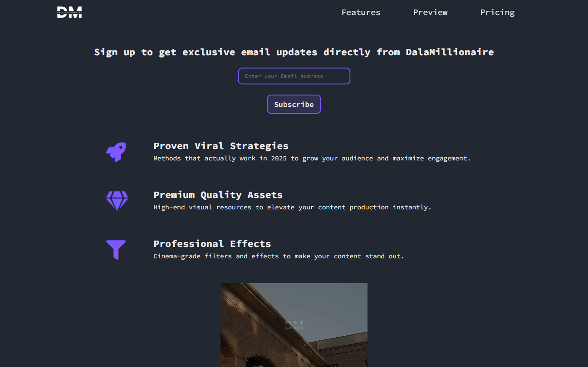

# Product Landing Page *(Certification Project)* | FCC Responsive Web Design Certification

**Project 17/20**

A modern and fully responsive product landing page built from scratch for the freeCodeCamp Responsive Web Design Certification. This project showcases a fictional product suite for content creators, using a clean layout, custom branding, animated features, and pricing cards — all crafted with semantic HTML and styled from the ground up using pure CSS 🎯✨.

---

## 📚 Table of Contents

- [🔎 Overview](#-overview)
  - [📸 Screenshot](#-screenshot)
  - [🔗 Links](#-links)
  - [📌 Features](#-features)
- [🧠 My process](#-my-process)
  - [🛠️ Built with](#️-built-with)
  - [🎓 What I learned](#-what-i-learned)
  - [🔙 Previous Project](#-previous-project)
  - [🔜 Next Project](#-next-project)
- [👤 Author](#-author)
  - [🌐 Connect with Me](#-connect-with-me)
  - [💻 Coding Profiles](#-coding-profiles)

---

## 🔎 Overview

### 📸 Screenshot

### 🔗 Links

 - [🔴 Live Demo](https://dalascript.github.io/product-landing-page/)
 - [🗂️ GitHub Repository](https://github.com/DalaScript/product-landing-page)

### 📌 Features

 - ✅ Sticky navigation with smooth scroll to sections
 - ✅ Email subscription form with validation
 - ✅ Feature cards with icons and clean layout
 - ✅ Embedded product preview video
 - ✅ Interactive pricing cards with hover effects
 - ✅ Responsive design using media queries
 - ✅ Custom-styled footer with useful links

## 🧠 My Process

### 🛠️ Built with

 - HTML5
 - CSS3

### 🎓 What I Learned

 - Building and structuring a full landing page independently
 - Designing interactive components like pricing cards and forms
 - Managing layout responsiveness for various screen sizes
 - Using CSS custom properties for scalable theme control
 - Embedding media and integrating external product links
 - Creating smooth user experiences through UI feedback and transitions

  > 🚀 For me, this project was more about **practice** and gaining additional **experience**,  
  > rather than learning something entirely new.  
  >  
  > 👨‍💻 Since I’m not a beginner and already familiar with these technologies,  
  > I approached it with confidence — and still, I truly **enjoyed working on it**.  
  >  
  > 🎯 Overall, I consider this a very **valuable and enjoyable experience**.

### 🔙 Previous Project

 - Magazine | *[Project 16/20]* → [View Repository](https://github.com/DalaScript/magazine)

### 🔜 Next Project

 - Ferris Wheel | *[Project 18/20]* → [View Repository](https://github.com/DalaScript/ferris-wheel)

---

## 👤 Author

### 🌐 Connect with Me

 - [Instagram](https://www.instagram.com/DalaScript)
 - [YouTube](https://www.youtube.com/@DalaScript)

### 💻 Coding Profiles

 - [freeCodeCamp](https://www.freecodecamp.org/DalaScript)
 - [FrontendMentor](https://www.frontendmentor.io/profile/DalaScript)
 - [GitHub](https://github.com/DalaScript)

*🙌 Thanks for checking out my project! More coming soon. Stay tuned 🚀*